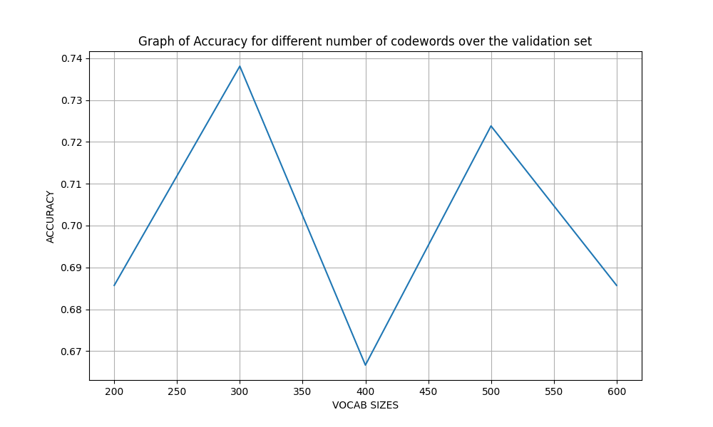
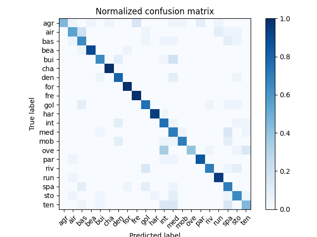
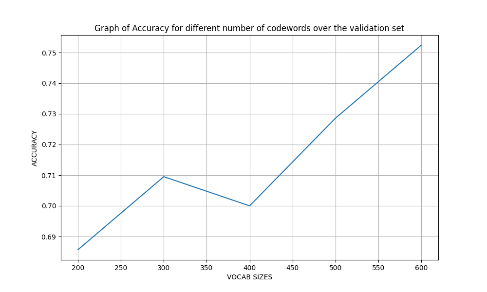
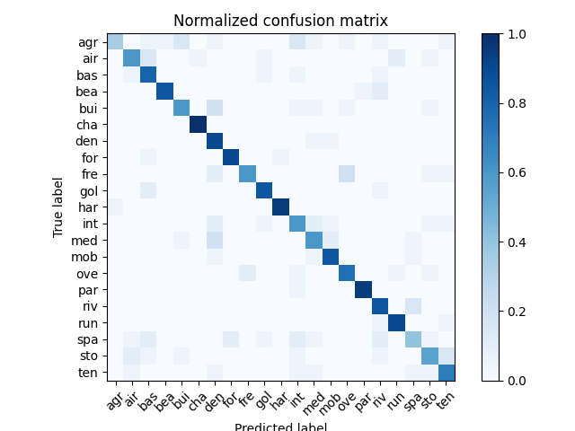
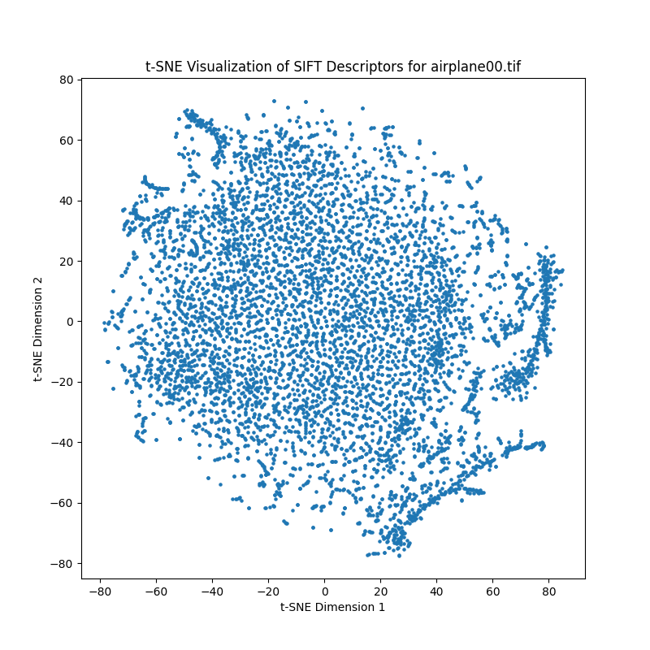
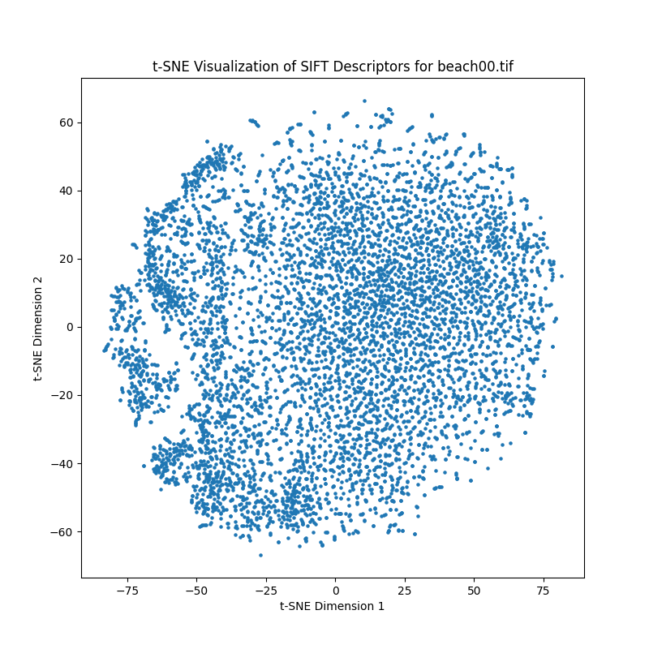
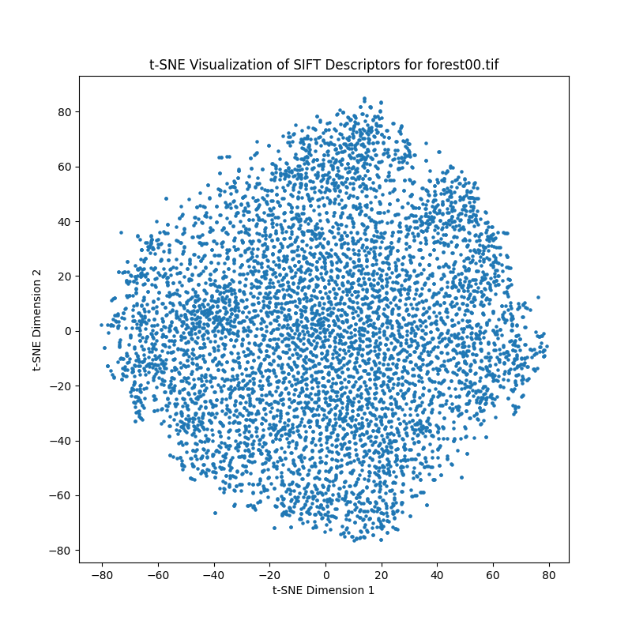
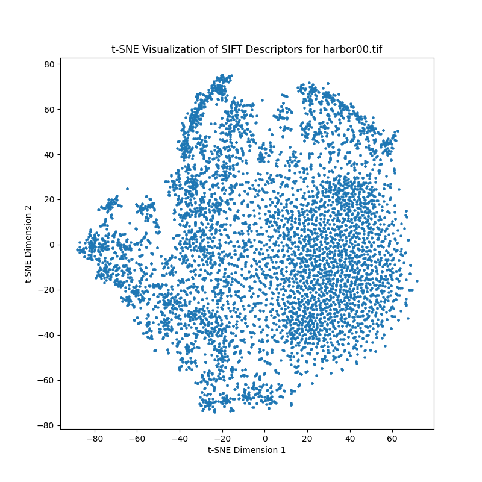
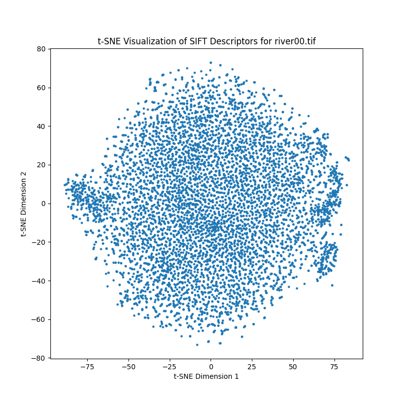

# GNR 638 Assignment 1

## Overview

The goal of this project is to perform classfication over images, specifically the [UCMerced Land Use data]( http://weegee.vision.ucmerced.edu/datasets/landuse.html). The data consists of 21 classes ranging from agricultural land, forests, industrial areas, to residential zones. Each class contains 100 images of 256x256 size in the '.tif' format. 

This project deals to perform a classification task on this dataset in the following settings

Creating features by :- [Bag of sift](https://liverungrow.medium.com/sift-bag-of-features-svm-for-classification-b5f775d8e55f)

Performing classification by
- Nearest Neighbor
- Support Vector Machines

Majority of the code base is inspired from [this project on Github](https://github.com/lionelmessi6410/Scene-Recognition-with-Bag-of-Words/blob/master/code/proj3.py), apart from the changes we made, which are listed below

## Steps to run code

```bash
python assignment.py --classifier nearest_neighbor
```

Change the classifier to either `nearest_neighbor` or `support_vector_machine` as required 

Then to run the evaluation, we have a similar command

```bash
python evaluate.py --classifier nearest_neighbor
```

Change the classifier to either `nearest_neighbor` or `support_vector_machine` as required 

## Changes done in the codebase

- Created a file [assignment.py](./code/assignment.py) which is based off [proj3.py](./code/proj3.py) but made it so that we can only control the classifier, and not the feature (fixed at bag_of_sift). 

- Since the dataset has been changed (in the folder [Merced](./Merced/)), the class names have been changed, so reading them in like this
```python
CATEGORIES=os.listdir(DATA_PATH)

CATE2ID = {v: k for k, v in enumerate(CATEGORIES)}

ABBR_CATEGORIES = [i[:3] for i in CATEGORIES]
```

- Additionally implemented the file reader such that it dynamically picks up on the train, validation and test file paths (since that partition isnt present originally in the data folder) based on the percentages in the assignment.py file like this
```python
TRAIN_PERCENT=70
VAL_PERCENT=10
TEST_PERCENT=20
```
- The paths are shuffled and then split into the given percentages to ensure unbiased training

- Since we have a validation split of 10%, we experiment for different values of number of codewords (vocab_size) to find the most optimal number of parameters for the classifiers. The values we check for in this validation set will be [200,300,400,500,600]

- The vocabulary, training_features, validation_features and testing_features are saved into .pkl files for the different values of the `vocab_size` parameter, to allow instantaneous testing.

- Since we are creating new vocabularies each time for each `vocab_size`, we read that particular file while creating the features, hence we update the [get_bags_of_sift.py](./code/get_bags_of_sifts.py) to use this `vocab_size`.

- Then after the features are created, we check which vocab_size performed the best in the val dataset, and this vocab_size is what will be used to evaluate against the test set for the final metrics
```python
 max_accuracy=0
best_vocab=0
for i in vocab_sizes:
    with open(f'history-{vocab_size}.pkl', 'rb') as handle:
        history = pickle.load(handle)
    if(store[i]['accuracy']>max_accuracy):
        max_accuracy=store[i]['accuracy']
        best_vocab=i

print('Best vocab size ',best_vocab)
```

#### Other important changes

- Since the images were in RGB format, they had 3 channels, which were not suitable to be fed into the dsift() function, so we approximated / converted the images to GREYSCALE since only 2D images could be fed into the function (Its a single channel now). We did these changes in [build_vocabulary.py](./code/build_vocabulary.py) and [get_bags_of_sift.py](./code/get_bags_of_sifts.py), like this
```python
img=Image.open(path)
img = img.convert("L")
img = np.asarray(img,dtype='float32')
```

- Since the entire process of creating the sift features was taking too long, used a tqdm loader in [build_vocabulary.py](./code/build_vocabulary.py) and [get_bags_of_sift.py](./code/get_bags_of_sifts.py) to measure the percentage of features created.
```python
for path in tqdm(image_paths):
img=Image.open(path)
```

- Created a [evaluate.py](../Scene-Recognition-with-Bag-of-Words/code/evaluate.py) to perform the validation check, create plots of validation accuracy, confusion matrix and finally produce the t-SNE representation of a few selected images

# RESULTS

Created a file [evaluate.py](./code/evaluate.py) to run these evaluations

## CLASSIFIER - NEAREST NEIGHBOR

To run this evaluation, run this command

```bash
python evaluate.py --classifier nearest_neighbor
```

The parameters used was
- K=1

Here are the results of the evaluation of the different `vocab_size` over the vaidation set (10%)



The best performing `vocab_size` is 300

So on running this `vocab_size` over the test_data(20%), here are the final metrics, along with the classwise accuracies

```
Accuracy = 0.7404761904761905

agricultural: 0.45
airplane: 0.55
baseballdiamond: 0.65
beach: 0.9
buildings: 0.65
chaparral: 1.0
denseresidential: 0.8
forest: 1.0
freeway: 1.0
golfcourse: 0.75
harbor: 0.95
intersection: 0.75
mediumresidential: 0.7
mobilehomepark: 0.7
overpass: 0.4
parkinglot: 0.85
river: 0.7
runway: 0.95
sparseresidential: 0.7
storagetanks: 0.65
tenniscourt: 0.45
```

Here are is the confusion matrix produced



## CLASSIFIER - SUPPORT VECTOR MACHINE

To run this evaluation, run this command

```bash
python evaluate.py --classifier support_vector_machine
```

The parameters used was
- C=500.0, 
- intercept_scaling=1
- loss='squared_hinge'
- max_iter= 5000
- penalty='l2'
- random_state=0
- tol= 1e-4

Here are the results of the evaluation of the different `vocab_size` over the vaidation set (10%)



The best performing `vocab_size` is 600

So on running this `vocab_size` over the test_data(20%), here are the final metrics, along with the classwise accuracies

```
Accuracy = 0.7404761904761905

agricultural: 0.35
airplane: 0.6
baseballdiamond: 0.8
beach: 0.85
buildings: 0.6
chaparral: 1.0
denseresidential: 0.9
forest: 0.9
freeway: 0.6
golfcourse: 0.85
harbor: 0.95
intersection: 0.6
mediumresidential: 0.6
mobilehomepark: 0.85
overpass: 0.75
parkinglot: 0.95
river: 0.85
runway: 0.9
sparseresidential: 0.4
storagetanks: 0.55
tenniscourt: 0.7
```

Here are is the confusion matrix produced



## t-SNE Representations of the keypoints

For this representation, we chose 5 images from 5 different classes as shown below
- 'Merced/airplane/airplane00.tif'
- 'Merced/beach/beach00.tif'
- 'Merced/forest/forest00.tif'
- 'Merced/harbor/harbor00.tif'
- 'Merced/river/river00.tif'

Here are the t-SNE representations of the keypoints from these images shown in 2 Dimensions








### Observations and Learnings

- Can quite easily notice that the SVM method is more of a machine learning method, and the higher the feature size (dimension of data) being fed into the model, it performs better. This is validated by the fact that the SVM performed the best using the bag of sift having vocabulary as 600, compared to the other sets which had lesser features (vocabulary size)

