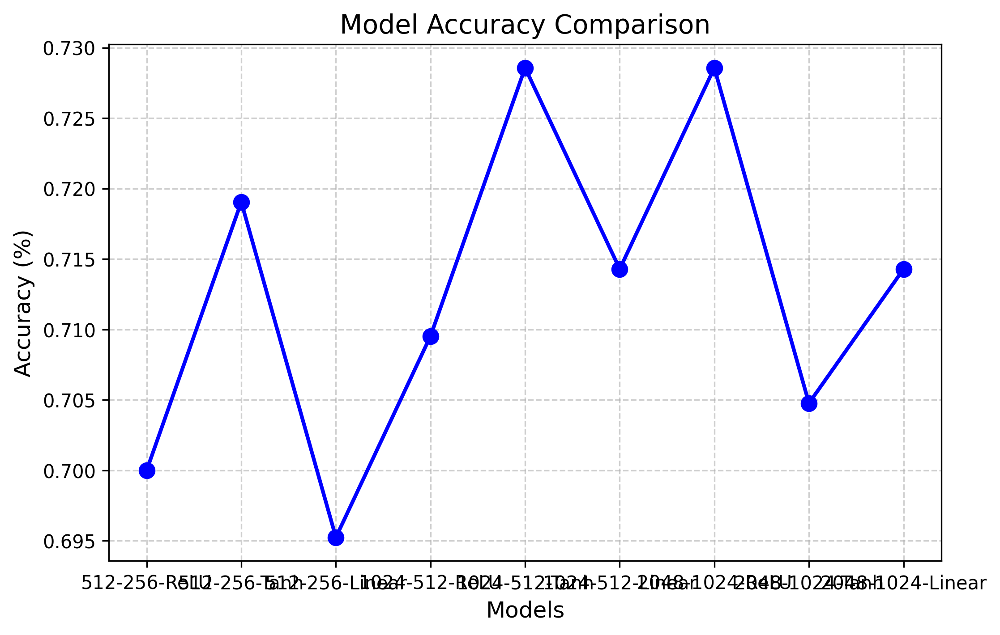

# GNR 638 Assignment-2

So this assignment has 2 parts. In both the parts, we have to implement a 3 Layer MLP model. In the first part we are supposed to use the already existing bag of sifts for the data, and in the second part we are supposed to resize the images, and flatten them before passing them into the model. In both the approaches, we are supposed to experiment on the hyperparameters of the models, and we chose the following values for the validation

- Hidden Layer sizes - [(512, 256), (1024, 512), (2048, 1024)]
- Activations - ['ReLU', 'Tanh', 'Linear']

## Using Bag of Sifts

So in this part we use the bag of sifts we created in the first part for a vocab size of 600. We use this particular vocab size since it was the largest, and having more meaningful (we consider them meaningful since they are extracted from ) input features is always better for a MLP model

The entire code for this part is in [code/mlp.py](./code/mlp.py)

### Steps to run the code

```bash
python mlp.py --classifier mlp
```

### Explaining the code

So on running the code, there are 2 main functions that are called
- `train_mlp` for training the models over the different hyperparameter settings
- `val_and_test_mlp` for validating the models, to choose one to perform the final test evaluation over

Here is how the MLP model is defined

```python

def __init__(self, input_size, activation,hidden_size1=2048, hidden_size2=1024, num_classes=21):
    super(MLP, self).__init__()
    self.fc1 = nn.Linear(input_size, hidden_size1)
    self.fc2 = nn.Linear(hidden_size1, hidden_size2)
    self.fc3 = nn.Linear(hidden_size2, num_classes)
    
    self.relu1 = nn.ReLU()
    self.relu2 = nn.ReLU()

    self.tanh1= nn.Tanh()
    self.tanh2= nn.Tanh()

    self.activation=activation

def forward(self, x):

    if(self.activation=='ReLU'):
        x = self.relu1(self.fc1(x))
        x = self.relu2(self.fc2(x))
        x = self.fc3(x)
    
    elif(self.activation=='Linear'):
        x = self.fc1(x)
        x = self.fc2(x)
        x = self.fc3(x)
    
    elif(self.activation=='Tanh'):
        x = self.tanh1(self.fc1(x))
        x = self.tanh2(self.fc2(x))
        x = self.fc3(x)

    return x
```

So that we can completely control the follow of information within the MLP model. 

The training procedure looks like this

```python
for epoch in range(num_epochs):
    loss_count=0
    for features, labels in train_loader:
        optimizer.zero_grad()
        outputs = model(features)
        loss = criterion(outputs, labels)
        loss_count+=loss.item()
        loss.backward()
        optimizer.step()
    scheduler.step(loss_count/len(train_loader))

    print(f'Epoch {epoch+1}/{num_epochs}, Loss: {loss.item():.4f}')
```
            

The models are then stored in this format based on the hyperparameters.

```bash
'./store/mlp_model_{activation}_{hidden_size1}_{hidden_size2}.pth'
```

Then in the validation and testing code, we test for which of the 9 models produced from this training combinations has the best performance, and then we go onto to evaluate that model over the test data to report the final accuracy of the model

Here are the validation results

```bash
Validation Accuracy (MLP) for pair_ReLU_512_256 : 0.7000
Validation Accuracy (MLP) for pair_Tanh_512_256 : 0.7190
Validation Accuracy (MLP) for pair_Linear_512_256 : 0.6952
Validation Accuracy (MLP) for pair_ReLU_1024_512 : 0.7095
Validation Accuracy (MLP) for pair_Tanh_1024_512 : 0.7286
Validation Accuracy (MLP) for pair_Linear_1024_512 : 0.7143
Validation Accuracy (MLP) for pair_ReLU_2048_1024 : 0.7286
Validation Accuracy (MLP) for pair_Tanh_2048_1024 : 0.7048
Validation Accuracy (MLP) for pair_Linear_2048_1024 : 0.7143

Best Validation Accuracy shows for pair (1024-512, Tanh) = 0.7285714149475098
Saving graph of validation accuracies to ../results/val-accuracies-MLP.png
```

This change in accuracy has been captured as seen through this graph



Finally now then we use the best performing over the test data, for which the accuracy is reported

```bash
STARTING TEST ON BEST PARAMETERS
ACCURACY FOR BEST MODEL for pair_(2048-1024, Linear) : 0.7286
```

## Using Reshaping and Flattening

The entire code for this part is in [code/flattened_mlp.py](./code/flattened_mlp.py)

### Steps to run the code

```bash
python flattened_mlp.py --classifier mlp
```

In this part, we dont use the bag of sifts, but apply these pre-processing steps
- Greyscale the image (making it one channel)
- Resize it to 72x72 
- Make a feature vector out of (flatten it)

```python
def resize_and_flatten(image_path, size=(72, 72)):

     image = Image.open(image_path)
     image = image.convert("L")

     image_resized = image.resize(size)

     image_array = np.array(image_resized)

     img_flattened = image_array.flatten()
     return img_flattened
```

After this, the entire pipeline is almost exactly the same, we use the same split for train, validation and testing. Finally here are the results from the cross-validation

```bash

Validation Accuracy (MLP) for pair_ReLU_512_256 : 0.0476
Validation Accuracy (MLP) for pair_Tanh_512_256 : 0.0476
Validation Accuracy (MLP) for pair_Linear_512_256 : 0.6857
Validation Accuracy (MLP) for pair_ReLU_1024_512 : 0.0476
Validation Accuracy (MLP) for pair_Tanh_1024_512 : 0.0476
Validation Accuracy (MLP) for pair_Linear_1024_512 : 0.5619
Validation Accuracy (MLP) for pair_ReLU_2048_1024 : 0.0476
Validation Accuracy (MLP) for pair_Tanh_2048_1024 : 0.0476
Validation Accuracy (MLP) for pair_Linear_2048_1024 : 0.7000

Best Validation Accuracy shows for pair (2048-1024, Linear) = 0.699999988079071
Saving graph of validation accuracies to ../results/val-accuracies-MLP-flattened.png  

```

This change in accuracy has been captured as seen through this graph


Finally now then we use the best performing over the test data, for which the accuracy is reported


```bash
STARTING TEST ON BEST PARAMETERS
ACCURACY FOR BEST MODEL for pair_(2048-1024, Linear) : 0.7000
```


### Observations and Learnings

- TanH surpringsly performed better than ReLU in the case of bag of sifts, but again the better performance was in the case of the hidden layer dimension not being too high or too low, need to find that sweet spot

- Since the entire greyscaling and then normal flattening of the pixels into a 1-D array looses out on a lot of the spatial properties otherwise present in images (Which would be captured in the case of bag of sift and CNN architectures). Hence this method is suboptimal, and in a way produces bad results with the MLP model since this makes it much harder to generalize and learn patterns when the data is shaped in this manner. (Possibly also a reason why Linear activation performed the best, since its not optimally learning due to the lost spatial awareness)